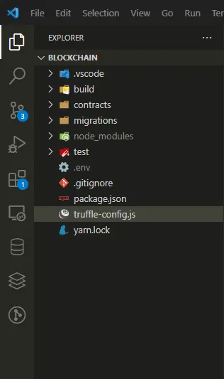
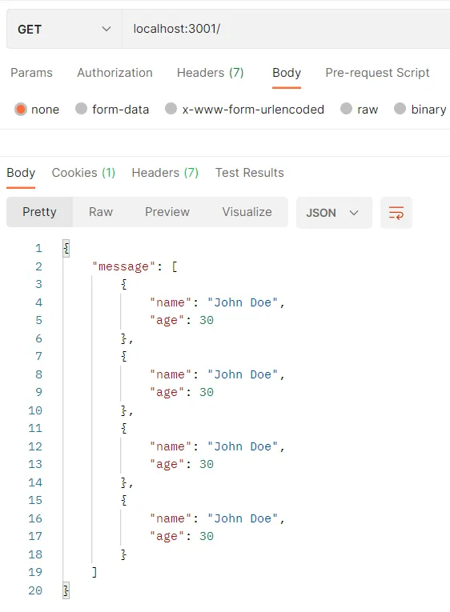
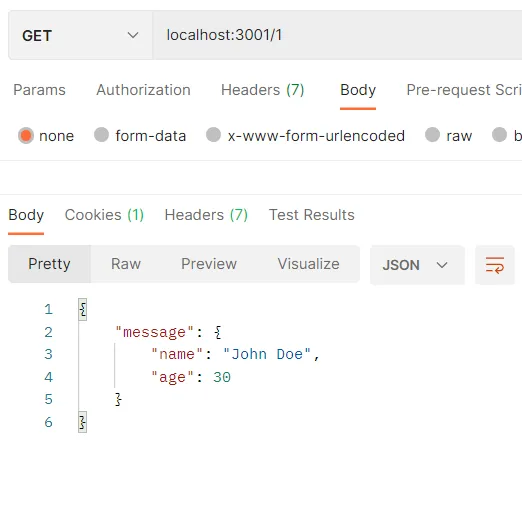

Blockchain and smart contracts are two of the most innovative technologies of the 21st century, and have the potential to revolutionize a wide range of industries, from finance and healthcare to supply chain management and real estate.

Blockchain is a decentralized digital ledger that records transactions across a network of computers. It uses cryptography to secure and verify transactions and control the creation of new units of a particular cryptocurrency.

Smart contracts are self-executing contracts with the terms of the agreement written directly into the code. They run on a blockchain network and enable secure, transparent and tamper-proof contract execution without the need for intermediaries.

Together, blockchain and smart contracts have the potential to increase efficiency, reduce costs, and improve transparency and security across multiple industries. For example, in the financial industry, blockchain can be used to streamline cross-border payments and reduce the risk of fraud, while smart contracts can automate the execution of financial agreements.

In this blog post, we will learn to build simple Smart Contract API using truffle and Tomochain.

## Setup Truffle

> Before we continue, i hoped that you already have a metamask account, if not, you can see how to create it here **[create-new-wallet](https://myterablock.medium.com/how-to-create-or-import-a-metamask-wallet-a551fc2f5a6b)**
> then add the tomochain testnet network **[add-tomochain-to-metamask](https://docs.tomochain.com/general/how-to-connect-to-tomochain-network/metamask)**
> and finally get the fund faucet, of the many networks, I think tomochain is the best in this case, on other networks it will usually give a little ethereum, 0.5 to 1 eth only. On tomochain we will get 15 TOMO. Get tomo fund here **[tomo-faucet](https://faucet.testnet.tomochain.com/)**


to get truffle, first we have to install it with npm or yarn globally

```bash
# npm
npm i -g truffle
# yarn
yarn global add truffle
```

there are two way to get started with truffle, *truffle init* or *truffle unbox*

```bash
truffle init
# or
truffle unbox
```



next is to install package *truffle-hdwallet-provider*

```bash
npm i truffle-hdwallet-provider
# or
yarn add truffle-hdwallet-provider
```

In this practice, we will use tomochain as a network blockchain, so we must add a network chain to the truffle configuration.

```javascript
'use strict'
var HDWalletProvider = require("truffle-hdwallet-provider");
require('dotenv').config()

var mnemonic = process.env.MNEMONIC;

module.exports = {
  compilers: {
    solc: {
      version: "^0.8.0"
    }
  },
  networks: {
    development: {
      provider: () => new HDWalletProvider(
        mnemonic,
        "http://127.0.0.1:8545",
      ),
      host: "127.0.0.1",
      port: "8545",
      network_id: "*", // Match any network id
    },
    tomotestnet: {
      provider: () => new HDWalletProvider(
        mnemonic,
        "https://rpc.testnet.tomochain.com",
        0,
        true,
        "m/44'/889'/0'/0/"
      ),
      network_id: "89",
      gas: 2000000,
      gasPrice: 10000000000
    },
    tomomainnet: {
      provider: () => new HDWalletProvider(
        mnemonic,
        "https://rpc.tomochain.com",
        0,
        true,
        "m/44'/889'/0'/0/",
      ),
      network_id: "88",
      gas: 2000000,
      gasPrice: 10000000000000,
    }
  }
};
```

change MNEMONIC env with your mnemonic wallet, more info here [link](https://metamask.zendesk.com/hc/en-us/articles/360015290032-How-to-reveal-your-Secret-Recovery-Phrase)

## Create Smart Contract

We will create a smart contract inside folder **contract** with name JsonArray.sol.
The contract has functions such as storeData() to adding Array data, getAllData() to getting all data, getData() to getting data by Id and also getArrayLength() to getting data length. 

```javascript
// SPDX-License-Identifier: MIT
pragma solidity >=0.4.22 <0.9.0;

contract JsonArray{
    string[] public jsonDataArray;

    function storeData(string memory _jsonData) public {
       jsonDataArray.push(_jsonData);
    }

    function getAllData() public view returns (string[] memory) {
        return jsonDataArray;
    }

    function getData(uint256 index) public view returns (string memory) {
        return jsonDataArray[index];
    }

    function getArrayLength() public view returns (uint256) {
        return jsonDataArray.length;
    }
}
```

Until here, to check we have to compile it. by running the following command:

```bash
truffle compile
```

it will compile all Smart Contract inside folder contract.

next we will deploy the smart contract by creating a file in the migrations folder with the name 1_migration.js

```javascript
const JsonArray = artifacts.require("JsonArray")

module.exports = function(deployer) {
  deployer.deploy(JsonArray);
};
```

To deploy smart contracts on the tomochain testnet network, run the following command

```bash
truffle migrate --network tomotestnet
```

and then you will get the transactions receipt

```bash
$ truffle migrate --network tomotestnet

Compiling your contracts...
===========================
> Compiling .\contracts\Count.sol solc-bin. Attempt #1
> Compiling .\contracts\JsonArray.sol
> Compiling .\contracts\JsonString.sol
> Artifacts written to D:\Software-Development\blockchain\build\contracts
> Compiled successfully using:
   - solc: 0.8.17+commit.8df45f5f.Emscripten.clang
⠦ Fetching solc version list from solc-bin. Attempt #1
⠏ Fetching solc version list from solc-bin. Attempt #1
Starting migrations...
======================
> Network name:    'tomotestnet'
> Network id:      89
> Block gas limit: 420000000 (0x1908b100)


1_migration.js
==============
⠴ Fetching solc version list from solc-bin. Attempt #1
   Deploying 'JsonArray'
   ---------------------
   > transaction hash:    0x7bbc9f3f5326ddef7756a796234d1b92c394197232ebe55c32650e3b1b61185e
   > Blocks: 0            Seconds: 0lc-bin. Attempt #1
   > contract address:    0x6f3c30D1151216BCEA768c0a35c99d9775d576bF
   > block number:        34187627
   > block timestamp:     1675181656
   > account:             0x82aAb6bc1b906dbE7F4053aE86469318b958a139
   > balance:             66.9123990505
   > gas used:            784391 (0xbf807)
   > gas price:           10 gwei
   > value sent:          0 ETH
   > total cost:          0.00784391 ETH

   > Saving artifacts
   -------------------------------------
   > Total cost:          0.00784391 ETH

Summary
=======
> Total deployments:   1
> Final cost:          0.00784391 ETH


Done in 17.87s.
```

Since tomochain uses the forked ethereum network, 1 TOMO = 1 ETH but has a different value, i.e. 1 ETH = $1,587.44 but 1 TOMO = $0.381312. In the above transaction, the amount of gas fee we need to pay is 0.00784391 TOMO or $0.00299. Very cheap, right?

## Calling Smart Contract function

To test your smart contract directly, you can use the online remix idea [Remix-Eth-IDE](https://remix.ethereum.org/). 
This time we will use web3.js, just create an api folder, and add the index.js file

```javascript
const Web3 = require('web3')
require('dotenv').config()
const provider = new Web3.providers.HttpProvider('https://rpc.testnet.tomochain.com')
const web3 = new Web3(provider)

const contractAddress = "0x6f3c30D1151216BCEA768c0a35c99d9775d576bF";
const abi = [
  {
    "inputs": [
      {
        "internalType": "uint256",
        "name": "",
        "type": "uint256"
      }
    ],
    "name": "jsonDataArray",
    "outputs": [
      {
        "internalType": "string",
        "name": "",
        "type": "string"
      }
    ],
    "stateMutability": "view",
    "type": "function",
    "constant": true
  },
  {
    "inputs": [
      {
        "internalType": "string",
        "name": "_jsonData",
        "type": "string"
      }
    ],
    "name": "storeData",
    "outputs": [],
    "stateMutability": "nonpayable",
    "type": "function"
  },
  {
    "inputs": [],
    "name": "getAllData",
    "outputs": [
      {
        "internalType": "string[]",
        "name": "",
        "type": "string[]"
      }
    ],
    "stateMutability": "view",
    "type": "function",
    "constant": true
  },
  {
    "inputs": [
      {
        "internalType": "uint256",
        "name": "index",
        "type": "uint256"
      }
    ],
    "name": "getData",
    "outputs": [
      {
        "internalType": "string",
        "name": "",
        "type": "string"
      }
    ],
    "stateMutability": "view",
    "type": "function",
    "constant": true
  },
  {
    "inputs": [],
    "name": "getArrayLength",
    "outputs": [
      {
        "internalType": "uint256",
        "name": "",
        "type": "uint256"
      }
    ],
    "stateMutability": "view",
    "type": "function",
    "constant": true
  }
];

const privateKey = process.env.WALLET_PRIVATE_KEY;
// Unlock wallet by private key
const account = web3.eth.accounts.privateKeyToAccount(privateKey)
let coinbase = account.address
web3.eth.accounts.wallet.add(privateKey);
web3.eth.defaultAccount = coinbase
console.log(coinbase)
```

> HttpProvider is the rpc network url of the chain to be used.
> contractAddress is the contract address obtained during deployment, see above.
> abi is json data from solidity compile, can be seen in the build/contracts/`{smart contract name}`.json folder.
> Private key can be seen in the metamask account, can read here **[Export-private-key](https://metamask.zendesk.com/hc/en-us/articles/360015289632-How-to-export-an-account-s-private-key)**
> coinbase is the address of our account (public key)

next is call function getAllData() and storeData() with dummy data using self execution function (()=>{})() :D

```javascript
const contract = new web3.eth.Contract(abi, contractAddress);
(async () => {
  // Calling function getAllData()
  await contract.methods.getAllData().call().then((v) => {
    const parsedData = v.map(jsonString => JSON.parse(jsonString));
    console.log(parsedData)
  })

  // Add data storeData()
  const dataDummy = {
    name: "John Doe",
    age: 30
  }

  const gasAmount = await contract.methods.storeData(JSON.stringify(dataDummy)).estimateGas({ from: coinbase });

  const tx = {
    from: coinbase,
    to: contractAddress,
    gas: Number(gasAmount),
    data: contract.methods.storeData(JSON.stringify(dataDummy)).encodeABI()
  }

  const signature = await web3.eth.accounts.signTransaction(tx, privateKey);
  await web3.eth.sendSignedTransaction(signature.rawTransaction).on("receipt", (receipt) => {
    // Data after sign storeData()
    contract.methods.getAllData().call().then(v => {
      console.log({ message: v, receipt });
    });
  })

})()
```

you will get response with receipt and state data before & after

```bash
$ node api/index.js
0x82aAb6bc1b906dbE7F4053aE86469318b958a139
[ { name: 'John Doe', age: 30 }, { name: 'John Doe', age: 30 } ]
{
  message: [
    '{"name":"John Doe","age":30}',
    '{"name":"John Doe","age":30}',
    '{"name":"John Doe","age":30}'
  ],
  receipt: {
    blockHash: '0xdcf2c86d0bdba12e086876402ad6855cc80a782e9c06a55942a0b11e0371e6e8',
    blockNumber: 34188640,
    contractAddress: null,
    cumulativeGasUsed: 51923,
    from: '0x82aab6bc1b906dbe7f4053ae86469318b958a139',
    gasUsed: 51923,
    logs: [],
    logsBloom: '0x00000000000000000000000000000000000000000000000000000000000000000000000000000000000000000000000000000000000000000000000000000000000000000000000000
00000000000000000000000000000000000000000000000000000000000000000000000000000000000000000000000000000000000000000000000000000000000000000000000000000000000000000000
00000000000000000000000000000000000000000000000000000000000000000000000000000000000000000000000000000000000000000000000000000000000000000000000000000000000000000000
00000000000000000000000000000000000000',
    status: true,
    to: '0x6f3c30d1151216bcea768c0a35c99d9775d576bf',
    transactionHash: '0x320656767171ea4e2fb222c289afafc477cb87f2a710c59860c35d2d2ab94209',
    transactionIndex: 1
  }
}
```

Next is to create an API with ExpressJS.
install express with the following command

```bash
npm install express --save
npm install body-parser
# or
yarn add express
yarn add body-parser
```

here is minimal express API

```javascript
const express = require('express')
const app = express()
const port = 3001

app.get('/', (req, res) => {
  res.send('Hello World!')
})

app.listen(port, () => {
  console.log(`Example app listening on port ${port}`)
})
```

here is the full code for the rest API

```javascript
const Web3 = require('web3')
const express = require('express')
var bodyParser = require('body-parser')
require('dotenv').config()
const app = express()
const port = 3001

app.use(bodyParser.json())


const provider = new Web3.providers.HttpProvider('https://rpc.testnet.tomochain.com')
const web3 = new Web3(provider)

const contractAddress = "0x6f3c30D1151216BCEA768c0a35c99d9775d576bF";
const abi = [
  {
    "inputs": [
      {
        "internalType": "uint256",
        "name": "",
        "type": "uint256"
      }
    ],
    "name": "jsonDataArray",
    "outputs": [
      {
        "internalType": "string",
        "name": "",
        "type": "string"
      }
    ],
    "stateMutability": "view",
    "type": "function",
    "constant": true
  },
  {
    "inputs": [
      {
        "internalType": "string",
        "name": "_jsonData",
        "type": "string"
      }
    ],
    "name": "storeData",
    "outputs": [],
    "stateMutability": "nonpayable",
    "type": "function"
  },
  {
    "inputs": [],
    "name": "getAllData",
    "outputs": [
      {
        "internalType": "string[]",
        "name": "",
        "type": "string[]"
      }
    ],
    "stateMutability": "view",
    "type": "function",
    "constant": true
  },
  {
    "inputs": [
      {
        "internalType": "uint256",
        "name": "index",
        "type": "uint256"
      }
    ],
    "name": "getData",
    "outputs": [
      {
        "internalType": "string",
        "name": "",
        "type": "string"
      }
    ],
    "stateMutability": "view",
    "type": "function",
    "constant": true
  },
  {
    "inputs": [],
    "name": "getArrayLength",
    "outputs": [
      {
        "internalType": "uint256",
        "name": "",
        "type": "uint256"
      }
    ],
    "stateMutability": "view",
    "type": "function",
    "constant": true
  }
];

const privateKey = process.env.WALLET_PRIVATE_KEY;
// Unlock wallet by private key
const account = web3.eth.accounts.privateKeyToAccount(privateKey)
let coinbase = account.address
web3.eth.accounts.wallet.add(privateKey);
web3.eth.defaultAccount = coinbase
console.log(coinbase)

const contract = new web3.eth.Contract(abi, contractAddress);


// call getAllData()
app.get('/', async (req, res) => {
  await contract.methods.getAllData().call().then((v) => {
    const parsedData = v.map(jsonString => JSON.parse(jsonString));

    return res.json({ message: parsedData });
  });
})

// call getData()
app.get('/:id', async (req, res) => {
  await contract.methods.getData(req.params.id).call().then((v) => {
    return res.json({ message: JSON.parse(v) });
  });
})

app.post('/', async (req, res) => {
  const { ...data } = req.body
  const gasAmount = await contract.methods.storeData(JSON.stringify(data)).estimateGas({ from: coinbase });

  const tx = {
    from: coinbase,
    to: contractAddress,
    gas: Number(gasAmount),
    data: contract.methods.storeData(JSON.stringify(data)).encodeABI()
  }

  const signature = await web3.eth.accounts.signTransaction(tx, privateKey);
  await web3.eth.sendSignedTransaction(signature.rawTransaction).on("receipt", (receipt) => {
    contract.methods.getAllData().call().then(v => {
      return res.json({ message: v, receipt });
    });
  })

})


app.listen(port, () => {
  console.log(`Example app listening on port ${port}`)
})
```

run the server with

```bash
node api/index.js
```

call getAllData()



call getData(id)



call storeData()


> #### Hopefully my writing can help, Thank you
