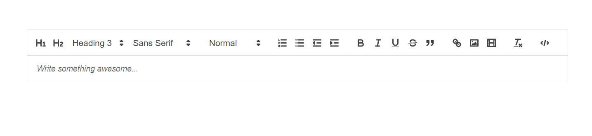
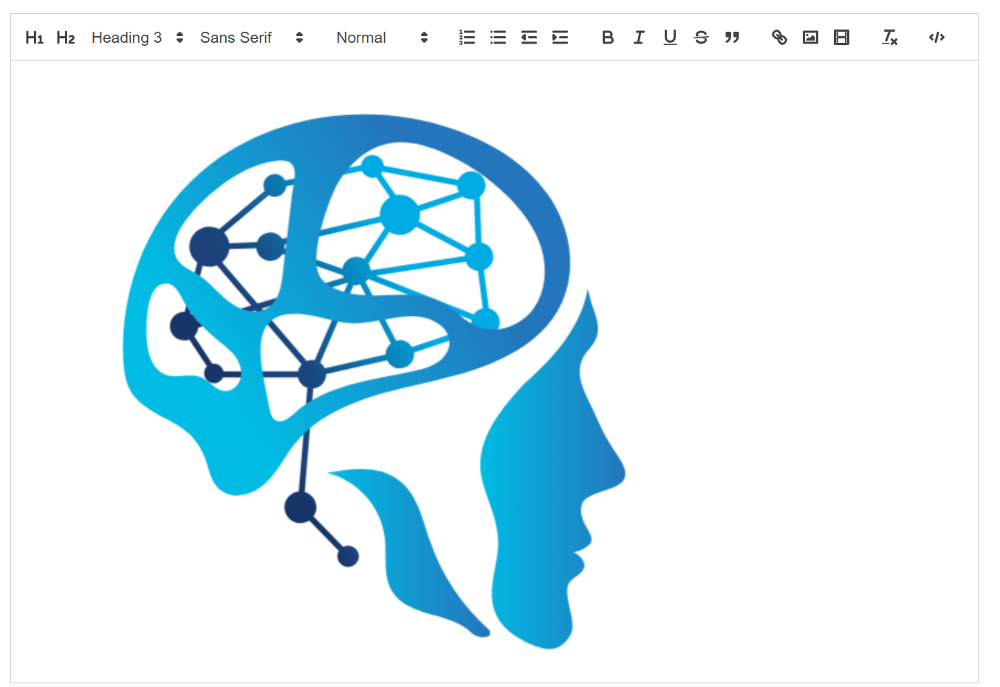

I'm thinking of making a mini project, a shared notepad, but I found the default Textarea limited. So I decided to find a Rich Text Editor, with options like CKEditor, Slate Rich Text Editor and Quill Text Editor.

CKEditor is a commercial Rich Text Editor with a free license option, but I changed my mind. I think an open source one would be better, I first tried SlateJS:

```typescript
import React, { useCallback, useMemo } from 'react'
import isHotkey from 'is-hotkey'
import { Editable, withReact, useSlate, Slate } from 'slate-react'
import {
  Editor,
  Transforms,
  createEditor,
  Descendant,
  Element as SlateElement,
} from 'slate'
import { withHistory } from 'slate-history'

import { Button, Icon, Toolbar } from '../components'

const HOTKEYS = {
  'mod+b': 'bold',
  'mod+i': 'italic',
  'mod+u': 'underline',
  'mod+`': 'code',
}

const LIST_TYPES = ['numbered-list', 'bulleted-list']
const TEXT_ALIGN_TYPES = ['left', 'center', 'right', 'justify']

const RichTextExample = () => {
  const renderElement = useCallback(props => <Element {...props} />, [])
  const renderLeaf = useCallback(props => <Leaf {...props} />, [])
  const editor = useMemo(() => withHistory(withReact(createEditor())), [])

  return (
    <Slate editor={editor} initialValue={initialValue}>
      <Toolbar>
        <MarkButton format="bold" icon="format_bold" />
        <MarkButton format="italic" icon="format_italic" />
        <MarkButton format="underline" icon="format_underlined" />
        <MarkButton format="code" icon="code" />
        <BlockButton format="heading-one" icon="looks_one" />
        <BlockButton format="heading-two" icon="looks_two" />
        <BlockButton format="block-quote" icon="format_quote" />
        <BlockButton format="numbered-list" icon="format_list_numbered" />
        <BlockButton format="bulleted-list" icon="format_list_bulleted" />
        <BlockButton format="left" icon="format_align_left" />
        <BlockButton format="center" icon="format_align_center" />
        <BlockButton format="right" icon="format_align_right" />
        <BlockButton format="justify" icon="format_align_justify" />
      </Toolbar>
      <Editable
        renderElement={renderElement}
        renderLeaf={renderLeaf}
        placeholder="Enter some rich text…"
        spellCheck
        autoFocus
        onKeyDown={event => {
          for (const hotkey in HOTKEYS) {
            if (isHotkey(hotkey, event as any)) {
              event.preventDefault()
              const mark = HOTKEYS[hotkey]
              toggleMark(editor, mark)
            }
          }
        }}
      />
    </Slate>
  )
}

const toggleBlock = (editor, format) => {
  const isActive = isBlockActive(
    editor,
    format,
    TEXT_ALIGN_TYPES.includes(format) ? 'align' : 'type'
  )
  const isList = LIST_TYPES.includes(format)

  Transforms.unwrapNodes(editor, {
    match: n =>
      !Editor.isEditor(n) &&
      SlateElement.isElement(n) &&
      LIST_TYPES.includes(n.type) &&
      !TEXT_ALIGN_TYPES.includes(format),
    split: true,
  })
  let newProperties: Partial<SlateElement>
  if (TEXT_ALIGN_TYPES.includes(format)) {
    newProperties = {
      align: isActive ? undefined : format,
    }
  } else {
    newProperties = {
      type: isActive ? 'paragraph' : isList ? 'list-item' : format,
    }
  }
  Transforms.setNodes<SlateElement>(editor, newProperties)

  if (!isActive && isList) {
    const block = { type: format, children: [] }
    Transforms.wrapNodes(editor, block)
  }
}

const toggleMark = (editor, format) => {
  const isActive = isMarkActive(editor, format)

  if (isActive) {
    Editor.removeMark(editor, format)
  } else {
    Editor.addMark(editor, format, true)
  }
}

const isBlockActive = (editor, format, blockType = 'type') => {
  const { selection } = editor
  if (!selection) return false

  const [match] = Array.from(
    Editor.nodes(editor, {
      at: Editor.unhangRange(editor, selection),
      match: n =>
        !Editor.isEditor(n) &&
        SlateElement.isElement(n) &&
        n[blockType] === format,
    })
  )

  return !!match
}

const isMarkActive = (editor, format) => {
  const marks = Editor.marks(editor)
  return marks ? marks[format] === true : false
}

const Element = ({ attributes, children, element }) => {
  const style = { textAlign: element.align }
  switch (element.type) {
    case 'block-quote':
      return (
        <blockquote style={style} {...attributes}>
          {children}
        </blockquote>
      )
    case 'bulleted-list':
      return (
        <ul style={style} {...attributes}>
          {children}
        </ul>
      )
    case 'heading-one':
      return (
        <h1 style={style} {...attributes}>
          {children}
        </h1>
      )
    case 'heading-two':
      return (
        <h2 style={style} {...attributes}>
          {children}
        </h2>
      )
    case 'list-item':
      return (
        <li style={style} {...attributes}>
          {children}
        </li>
      )
    case 'numbered-list':
      return (
        <ol style={style} {...attributes}>
          {children}
        </ol>
      )
    default:
      return (
        <p style={style} {...attributes}>
          {children}
        </p>
      )
  }
}

const Leaf = ({ attributes, children, leaf }) => {
  if (leaf.bold) {
    children = <strong>{children}</strong>
  }

  if (leaf.code) {
    children = <code>{children}</code>
  }

  if (leaf.italic) {
    children = <em>{children}</em>
  }

  if (leaf.underline) {
    children = <u>{children}</u>
  }

  return <span {...attributes}>{children}</span>
}

const BlockButton = ({ format, icon }) => {
  const editor = useSlate()
  return (
    <Button
      active={isBlockActive(
        editor,
        format,
        TEXT_ALIGN_TYPES.includes(format) ? 'align' : 'type'
      )}
      onMouseDown={event => {
        event.preventDefault()
        toggleBlock(editor, format)
      }}
    >
      <Icon>{icon}</Icon>
    </Button>
  )
}

const MarkButton = ({ format, icon }) => {
  const editor = useSlate()
  return (
    <Button
      active={isMarkActive(editor, format)}
      onMouseDown={event => {
        event.preventDefault()
        toggleMark(editor, format)
      }}
    >
      <Icon>{icon}</Icon>
    </Button>
  )
}

const initialValue: Descendant[] = [
  {
    type: 'paragraph',
    children: [
      { text: 'This is editable ' },
      { text: 'rich', bold: true },
      { text: ' text, ' },
      { text: 'much', italic: true },
      { text: ' better than a ' },
      { text: '<textarea>', code: true },
      { text: '!' },
    ],
  },
  {
    type: 'paragraph',
    children: [
      {
        text: "Since it's rich text, you can do things like turn a selection of text ",
      },
      { text: 'bold', bold: true },
      {
        text: ', or add a semantically rendered block quote in the middle of the page, like this:',
      },
    ],
  },
  {
    type: 'block-quote',
    children: [{ text: 'A wise quote.' }],
  },
  {
    type: 'paragraph',
    align: 'center',
    children: [{ text: 'Try it out for yourself!' }],
  },
]

export default RichTextExample
```

I didn't end up using slate js, because I couldn't find these components in its folder structure: import \{ Button, Icon, Toolbar } from '../components'

So I decided to try the third option, Quill. The result was good and easy to understand.

The installation is:

`yarn add react-quill`

`For Next.js users, it needs to be dynamically imported, since the document object is not found during initial load.`

```typescript
import dynamic from 'next/dynamic';
import React, { LegacyRef, useEffect, useRef, useState } from 'react';
import type ReactQuill from 'react-quill';
import 'react-quill/dist/quill.snow.css';

interface IWrappedComponent extends React.ComponentProps<typeof ReactQuill> {
  forwardedRef: LegacyRef<ReactQuill>
}

const ReactQuillBase = dynamic(
  async () => {
    const { default: RQ } = await import('react-quill')

    function QuillJS({ forwardedRef, ...props }: IWrappedComponent) {
      return <RQ ref={forwardedRef} {...props} />
    }

    return QuillJS
  },
  {
    ssr: false,
  },
)
```

Then I added a useState handler to save changes:

```typescript
const [value, setValue] = useState('');
const quillRef = useRef<ReactQuill>(null)
```

 also added modules for the toolbar, which will shown in the Header of Editor:

```typescript
  const modules = useMemo(() => ({
    toolbar: {
      container: [
        [{ header: '1' }, { header: '2' }, { header: [3, 4, 5, 6] }, { font: [] }],
        [{ size: [] }],
        [{ 'list': 'ordered' }, { 'list': 'bullet' }, { 'indent': '-1' }, { 'indent': '+1' }],
        ['bold', 'italic', 'underline', 'strike', 'blockquote'],
        ['link', 'image', 'video'],
        ['clean'],
        ['code-block']
      ],
      handlers: {
        image: imageHandler,
      }
    }
  }), [])
```

And called the ReactQuill component:

```typescript
<div>
     <ReactQuillBase forwardedRef={quillRef}
        className='w-full'
        theme="snow"
        value={value}
        onChange={setValue}
        modules={modules}
        placeholder={"Write something awesome..."}
 </div>
```



How was it? It's good right?

Next we will add an image upload handler, using S3, as seen there is an image icon, but currently it cannot be used. Let's just install aws-sdk first with `yarn add aws-sdk` and configure the key

```typescript
const AWS_S3_BUCKET = process.end.NEXT_PUBLIC_bucket;
const s3 = new AWS.S3({
  region: "auto",
  accessKeyId: process.env.NEXT_PUBLIC_accessKeyId,
  secretAccessKey: process.env.NEXT_PUBLIC_secretAccessKey,
  endpoint: process.env.NEXT_PUBLIC_S3_endpoint,
});
```

Then added an imageHandler function:

```typescript
  const imageHandler = () => {

    const editor = (quillRef as any)?.current.getEditor();
    if (typeof document !== 'undefined') {
      const input = document.createElement("input");
      input.setAttribute("type", "file");
      input.setAttribute("accept", "image/*");
      input.click();

      input.onchange = async () => {
        const file = (input as any)?.files[0];
        if (/^image\//.test(file.type)) {
          console.log(file);
          const key = crypto.randomBytes(5).toString('hex') + file.name;
          const url = process.env.NEXT_PUBLIC_S3_endpoint;
          const linkUrl = `${url}/${key}`;
          const params: AWS.S3.Types.PutObjectRequest = {
            Bucket: AWS_S3_BUCKET,
            Key: key,
            Body: file,
            ContentType: file.type,
            ACL: 'public-read',
          };
          const data: any = await s3.putObject(params).promise();
          console.log(data)
          if (data) {
            editor.insertEmbed(editor.getSelection(), "image", linkUrl);
          }
        } else {
          console.log('You could only upload images.');
        }
      };
    }
  }
```



The question is, how to save to the database then display it again?

We can save it in string form with `JSON.stringify(value)`, the string will looks like this:

```typescript
const INITIAL = `<p>Hello</p><p>How are you?</p><p>are you okay?</p><p>Love you</p><p><br></p><p></p>`
```

Then, we can load it using useEffect

```typescript
  useEffect(() => {
    setValue(INITIAL);
  }, [])
```