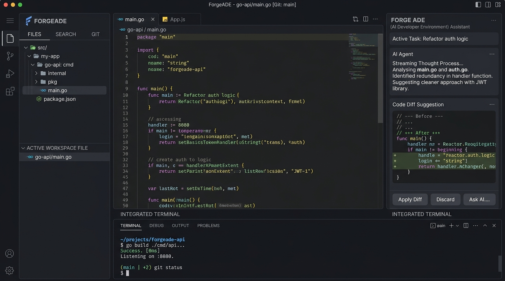

**ForgeADE** is a native, lightweight, AI-first development workspace built for modern software engineers. Unlike traditional IDEs that treat AI as an extension, ForgeADE treats AI agents, terminals, Git, and projects as first-class citizens — all running locally with minimal resource usage.

View Repository: [GitHub (Haslab-dev/forge-ade)](https://github.com/Haslab-dev/forge-ade)

## Philosophy & Core Principles

- **Native First**: No Electron bloat. Powered by a Go backend paired with a high-performance native WebView frontend.
- **Workspace First**: Everything belongs to a structured workspace; folders are treated as agile, temporary workspaces.
- **AI Native**: AI intelligence is deeply embedded into the architecture and pipeline, not tacked on as an afterthought.
- **Ultra Lightweight**: Blazing fast startup times, rapid file indexing, and minimal RAM footprint.
- **Offline First**: All core editor capabilities and local LLMs run seamlessly offline; cloud capabilities are optional.

## Key Features

- **Code Editor**: High-performance code editor powered by CodeMirror 6 with syntax highlighting, auto-complete, and multi-file tabs.
- **Integrated AI Assistant**: Real-time streaming thoughts, automated code diff proposals with one-click `Apply Diff` or `Discard`.
- **Integrated Terminal & Git**: Native pseudo-terminal with instant compilation and interactive Git branch inspection.
- **Project Explorer**: Clean directory tree navigation, quick file search, and active workspace tracking.

## Tech Stack

- **Desktop Framework**: Wails (Go backend + WebView)
- **Frontend**: React, TypeScript, Tailwind CSS
- **Editor Engine**: CodeMirror 6
- **Language**: Go (Golang) & TypeScript
