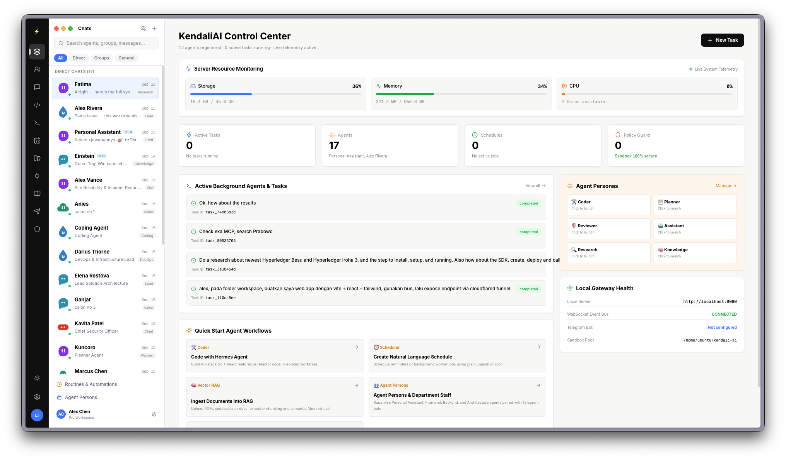
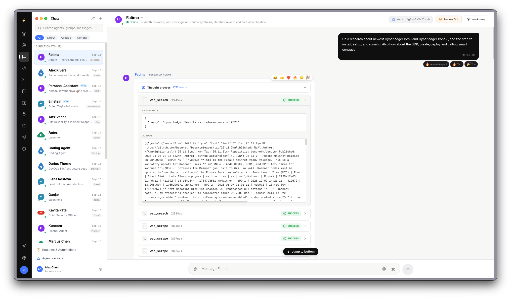

**KendaliAI** is an autonomous AI agent orchestration platform and command center designed to monitor, supervise, and coordinate intelligent multi-agent workflows with live telemetry.

View Repository: [GitHub (Haslab-dev/KendaliAI)](https://github.com/Haslab-dev/KendaliAI)

## Key Capabilities

- **Command & Control Center**: Centralized dashboard displaying active background agents, live server telemetry (Storage, Memory, CPU), active schedules, and security policy guard statuses.
- **Multi-Agent Chat Interface**: Interactive conversational UI with diverse agent personas (Coder, Planner, Reviewer, Assistant, Research, Knowledge) and inline reasoning / thought-process tracking.
- **Workflow & Background Tasks Execution**: Robust task runner capable of delegating web searches, code synthesis, git worktree checkouts, and custom automated routines.
- **Vector RAG Ingestion**: Built-in document and codebase chunking pipelines for semantic retrieval and context augmentation.
- **Local Gateway Health**: Real-time WebSocket event bus, Telegram bot integrations, and sandboxed execution roots.

## Tech Stack

- **Frontend**: React, TypeScript, Tailwind CSS
- **Backend / Runtime**: Node.js / Bun / Python
- **Orchestration**: WebSocket Event Bus, Multi-Agent Workers
- **Vector Search / Knowledge**: Vector RAG Pipelines
