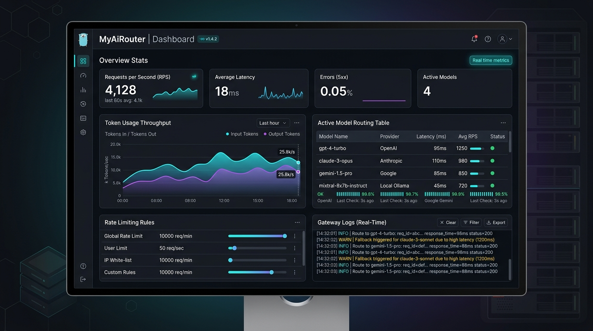

**MyAiRouter** is an ultra-fast, lightweight AI model gateway and proxy router built with Go for maximum performance and an exceptionally low system footprint, inspired by 9router.

View Repository: [GitHub (Haslab-dev/MyAiRouter)](https://github.com/Haslab-dev/MyAiRouter)

## Key Features

- **Multi-Provider Routing**: Seamlessly route API requests across OpenAI, Anthropic Claude, Google Gemini, and local Ollama instances through a unified endpoint.
- **Ultra-Low Latency & High Throughput**: Built from the ground up in Go, processing thousands of requests per second (RPS) with sub-20ms overhead.
- **Intelligent Failover & Health Checks**: Automatically detects model downtime or latency spikes and redirects incoming traffic to healthy fallback models without interrupting clients.
- **Real-Time Analytics Dashboard**: Live metrics for requests per second, token throughput (input/output tokens), average latency graphs, and recent gateway logs.
- **Dynamic Rate Limiting**: Granular global, per-user, and IP-level rate-limiting rules and quotas.

## Tech Stack

- **Core Engine & Backend**: Go (Golang)
- **Monitoring & Telemetry**: Real-time WebSocket streaming & metrics collectors
- **Dashboard**: Modern Web Console (React / Tailwind CSS)
