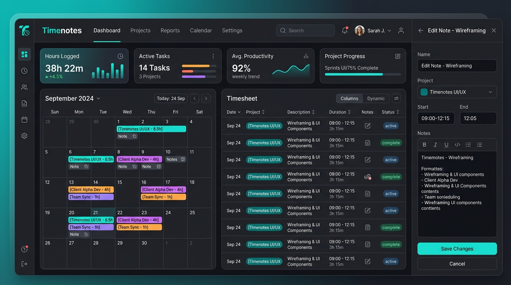

**Timenotes** is a high-density, modern time tracking and productivity web application engineered to give professionals and developers maximum clarity over their work hours, projects, and tasks.

View Repository: [GitHub (Haslab-dev/Timenotes)](https://github.com/Haslab-dev/Timenotes)

## Key Features

- **Google-style Calendar**: A comprehensive monthly overview featuring color-coded project pills and integrated note indicators for quick status checks.
- **Ultra-Compact Timesheet**: High-density list views with tight typography (`leading-[1.1]`) and zero-margin formatting designed for maximum information display and fast scanning.
- **Integrated Side Panels**: View, inspect, and edit time entries or notes smoothly without losing your current view, powered by slide-over overlay panels.
- **Unified Dashboard**: A central command center combining productivity trend charts, recent activities, logged hours statistics, and a monthly activity calendar.
- **Mobile Optimized**: Fully responsive interface featuring a ergonomic bottom navigation bar, mobile-dedicated edit workflows, and a quick "Scroll-to-Top" Floating Action Button (FAB).
- **Automatic Quality Control**: Integrated Husky and Prettier git hooks ensuring that every piece of pushed code strictly follows consistent team code formatting and standards.

## Tech Stack

- **Frontend Framework**: React / Next.js
- **Language**: TypeScript
- **Styling**: Tailwind CSS
- **Code Quality**: Husky, Prettier, ESLint
